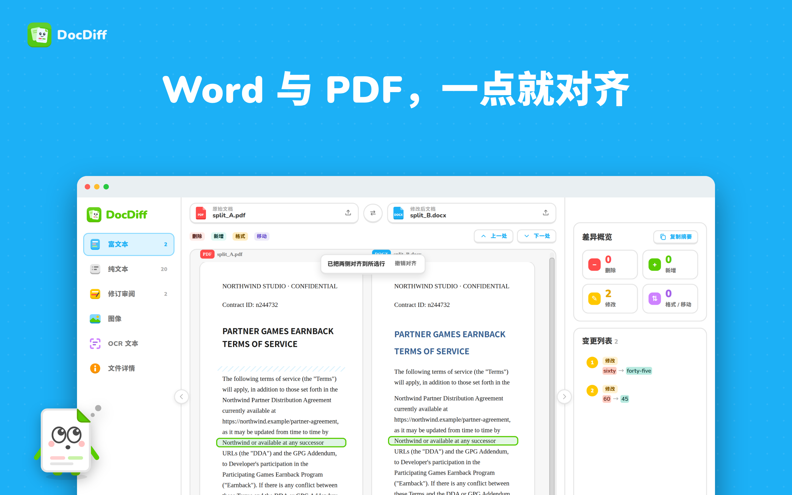

# DocDiff

本地离线文档比对工具：比较 **DOCX、PDF、TXT**，任意两种格式互相比较。所有处理都在本机完成，不联网，也不上传文件。

界面语言支持中文和 English，支持 macOS（Apple 芯片 / Intel）和 Windows。


<details>
<summary>更多界面截图</summary>




</details>

## 比较模式

| 模式 | 作用 |
|---|---|
| **富文本** | 两份文档并排显示，保留标题、列表、表格、加粗/斜体/字号/颜色。删除标红，新增标绿，格式变化用橙色下划线，移动的段落用紫框标出。 |
| **纯文本** | 只比较文字，逐行对齐，带行号。可以切换"并排 / 合并"布局，也可以隐藏未变化的行。 |
| **修订** | 把两份文档合并成一份修订稿：删除显示为删除线，新增显示为下划线。每处修改可以**接受或拒绝**，结果可以导出为 **PDF**、**Word 修订稿**（保留标记）或 **Word 最终稿**。 |
| **图像** | 把两份文档渲染成页面图片，逐像素比较，并框出差异区域。有 4 种视图：并排、差异、淡化、滑块。可以发现版面、页边距、图片、分页上的变化。 |
| **OCR 文本** | 先识别页面上的文字，再做文本比较。适合扫描件和图片型 PDF。内置**中文和英文**离线识别模型。 |
| **文件详情** | 比较文件本身的信息：大小、时间、SHA-256、页数、字数，以及作者、标题、修订号等文档属性。 |

## 下载安装

安装包在 **[Releases 页面](https://github.com/evonotevil/DocDiff/releases/latest)** 下载：

| 系统 | 下载 | 安装方法 |
|---|---|---|
| Mac（Apple 芯片 M1–M4） | [DocDiff-1.4.2-mac-arm64.dmg](https://github.com/evonotevil/DocDiff/releases/download/v1.4.2/DocDiff-1.4.2-mac-arm64.dmg) | 双击打开，把 DocDiff 拖到"应用程序" |
| Mac（Intel 芯片） | [DocDiff-1.4.2-mac-x64.dmg](https://github.com/evonotevil/DocDiff/releases/download/v1.4.2/DocDiff-1.4.2-mac-x64.dmg) | 同上 |
| Windows 10 / 11（64 位） | [DocDiff-Setup-1.4.2.exe](https://github.com/evonotevil/DocDiff/releases/download/v1.4.2/DocDiff-Setup-1.4.2.exe) | 双击安装，可选择安装位置 |
| Windows 免安装版 | [DocDiff-1.4.2-win-x64.zip](https://github.com/evonotevil/DocDiff/releases/download/v1.4.2/DocDiff-1.4.2-win-x64.zip) | 解压后运行 `DocDiff.exe` |

不确定 Mac 是哪种芯片？点屏幕左上角的苹果菜单，选"关于本机"，查看"芯片"一栏。

每个版本附带 `SHA256SUMS.txt`，可以用 `shasum -a 256 <文件>` 校验下载是否完整。

**Mac 第一次打开时**，系统会提示"无法验证开发者"，因为应用没有 Apple 开发者证书。按下面任一方法处理（只需一次）：

- 打开"系统设置 → 隐私与安全性"，拉到底部，点 **"仍要打开"**
- 或在"终端"执行：`xattr -dr com.apple.quarantine /Applications/DocDiff.app`

**Windows 第一次运行安装程序时**，SmartScreen 可能提示"Windows 已保护你的电脑"（安装程序没有代码签名证书）。点 **"更多信息 → 仍要运行"** 即可。

## 使用方法

1. 把两个文件分别拖到"原始文档"和"修改后文档"。也可以点"选择文件"，或者一次拖入两个文件。
2. 点 **查找差异**。
3. 在「富文本」里把鼠标移到任意一行，会框出这一行和另一侧对应的行；点一下，两侧就对齐到这一行（再按 Esc 或点「撤销对齐」恢复）。
4. 用左侧导航切换模式。右侧的变更列表可以点击，页面会跳到对应位置；文档右边的彩色细条是"差异地图"，也可以点击跳转。
5. 在「修订审阅」里按 A 接受、R 拒绝，逐条处理；全部处理完会出现完成页，可以直接导出。
6. 比较过程中，如果在 Word 里修改并保存了文档，顶部会提示"已更新"，点「重新比较」即可。
7. 右侧「复制摘要」会把所有差异整理成 Markdown，可以直接粘贴到邮件、飞书或文档里。
8. 左右两侧边栏都可以折叠，给对比区腾出空间；设置里可以切换语言（中文 / English）、浅色 / 深色、提示音，并查看全部快捷键。

**快捷键**

| 快捷键 | 作用 |
|---|---|
| ⌘O / ⇧⌘O（Windows：Ctrl+O / Ctrl+Shift+O） | 打开原始 / 修改后文档 |
| ⌘1 … ⌘6（Windows：Ctrl+1 … Ctrl+6） | 切换 6 种模式 |
| J / K（或 F7 / ⇧F7） | 下一处 / 上一处差异 |
| A / R / U | 修订审阅：接受 / 拒绝 / 撤销 |
| Enter | 首页：开始比较 |
| ⇧⌘S | 交换左右文档 |
| ⌘N | 新建比较 |

**选项说明**

- **忽略空白差异**（默认开启）：多一个空格、换行符不同，都不算作差异。
- **按词 / 按字符**：高亮的粒度。中文始终按单个汉字比较。
- **检测格式变化**：两份文档格式相同（都是 DOCX 或都是 PDF）时默认开启。DOCX 和 PDF 的字体信息来源不同，互相比较时默认关闭。
- **忽略全角 / 半角标点**：把「，」和「,」、「（」和「(」视为相同，适合中英文混排的合同。
- **检测移动的段落**：如果一整段只是换了位置，会标为"移动"，不再显示为一处删除加一处新增。

还可以用命令行直接打开两个文件：`npx electron . a.docx b.pdf`

`samples/` 目录里有几组示例文件，可以先用来试用。

## 从源码运行

需要 Node.js 18 或更高版本：

```bash
git clone https://github.com/evonotevil/DocDiff.git
cd DocDiff
npm install     # 第一次运行需要，会下载 Electron（约 100MB）
npm start       # 构建界面并启动应用
```

> **国内网络下载慢？** 可以在 `npm install` 之前先执行：
>
> ```bash
> npm config set registry https://registry.npmmirror.com
> export ELECTRON_MIRROR="https://npmmirror.com/mirrors/electron/"
> ```

自己打包：

```bash
npm run dist:arm64    # macOS Apple 芯片（M1–M4）
npm run dist:x64      # macOS Intel 芯片
npm run dist:win      # Windows 安装包（在 Windows 上执行；在 Mac/Linux 上需要安装 Wine）
```

打包结果在 `release/` 目录。应用没有做开发者签名，如果把安装包拷到其他电脑后系统提示"无法打开"或"已损坏"，在 Finder 里右键点应用选"打开"，或在终端执行 `xattr -cr /Applications/DocDiff.app`。

## 技术栈

Electron 37 · React 18 · Vite 6 · pdf.js · docx-preview · jsdiff · pixelmatch · tesseract.js 5（语言包随应用离线打包）· docx

```
electron/
  main.cjs        主进程：窗口、菜单、文件读写、DOCX/TXT 排版转 PDF、OCR、导出
  preload.cjs     安全桥接（contextIsolation）
renderer/
  index.html      主界面
  render.html     隐藏窗口，用来把 DOCX/TXT 排版成页面（图像 / OCR 模式使用）
  src/
    App.tsx       界面与状态
    lib/docx.ts   解析 DOCX（样式、标题、列表编号、表格、图片、文档属性）
    lib/pdf.ts    解析 PDF（行→段落、标题/列表/表格推断、字体粗斜体）+ 页面渲染
    lib/txt.ts    解析 TXT（自动识别 UTF-8 / GBK / Big5 / UTF-16 编码）
    lib/engine.ts 比较引擎：段落对齐 → 相似段落配对 → 词/字级比较 → 格式比较 → 移动检测
    lib/pages.ts  图像比较（pixelmatch + 差异区域聚类）
    lib/exportDocx.ts  导出 Word 修订稿 / 最终稿
    views/        富文本 / 纯文本 / 修订 / 图像 / 文件详情 各视图
```

## 已知限制

- 不支持旧版 `.doc` 格式，请先在 Word 里另存为 `.docx`。
- DOCX 在"图像"模式下由本机排版渲染，分页可能与 Word 略有不同。PDF 的排版则是原样呈现。
- PDF 本身没有段落和标题结构。DocDiff 根据字号、行距和缩进推断这些结构，复杂的多栏排版可能不够准确。
- 页眉、页脚、批注暂时不参与比较。
- 导出的 Word 文件里，图片用"[图片]"占位。
- OCR 识别每页大约需要 3–5 秒。第一次使用时会把语言包解压到用户数据目录（Mac：`~/Library/Application Support/DocDiff/tesscache`；Windows：`%APPDATA%\DocDiff\tesscache`）。

## 反馈与许可

遇到问题？先看[常见问题](https://github.com/evonotevil/DocDiff/issues/1)，或在 [Issues](https://github.com/evonotevil/DocDiff/issues) 里反馈。

[MIT License](LICENSE)
